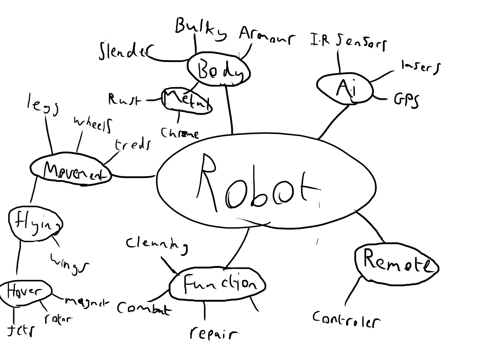

# Analyse

In de analyse vinden we de volgende elementen terug:
- Een mindmap
- Een beschrijving
- Hardware analyse
- Software  analyse 
- Taakverdeling
- Systeem specificaties

## Mindmap

Mindmapping is een techniek waarbij je alle losse idee over het project aan
elkaar probeert te koppel zodat je een referentiepunt hebt over de zaken die je
moet analyseren over het project. Deze simpele stap geeft het start schot voor
de analyse. Goed begonnen is half gewonnen.  De mindmap is een figuur zoals in
onderstaand voorbeeld waarin het project. Hoe meer verfijnd de mindmap is
opgesteld hoe gemakkelijker de uitvoering wordt en hoe beter de benodigde tijd
en mankracht kan worden ingeschat.

**Je begint best op papier maar de versie voor in de analyse moet digitaal zijn.**

# Specieke analyse

## Hardware analyse
Aan dit project is er ook een fysieke component die bestaat uit verschillende
bouwblokken. De doel van dit gedeelte is te zien hoe dat deze verschillende
blokken aan elkaar vasthangen. Je kan een motor wel vast hangen aan stroombron
maar zonder een sturing ga je er niet veel aan hebben. 

Naast de onderliggende connecties moet je ook de vereisten van elke blok
verzamelen en/of opstellen. Als we terug kijken naar de motorsturing kunnen we
niet lukraak een kopen. We moeten zien hoeveel stroom dat onze motor trekt en
hiervoor dan een gepaste motorsturing maken of kopen.

De fysieke component word door de meeste studenten vaak onderschat. Je kan geen
nieuwe versie van de hardware maken door opnieuw te compileren. Het kost tijd
om de hardware te ontwerpen, de nodige items te verzamelen en dan te
assembleren.

**Een basis voorbeeld van een hardware analyse**

Bij een analyse hoort ook een verdediging waarom dat je iets gebruikt. In het
basis voorbeeld staat er dat we een nRF24L01 gebruiken. Waarom gebruik we deze
module?, wat zijn de voordelen hiervan?, hoe past het in het grote geheel? en
wat zijn de mogelijke alternatieven. Deze vragen moet je kunnen beantwoorden.
 

## Software analyse

Aangezien we de schakelingen opbouwen met programmeerbare hardware, zal het
noodzakelijk zijn om naast een analyse van de hardware ook een analyse van de
software op te stellen. De beste mannier om dit duidelijk weer te geven is door
het maken van een aantal flow charts

Net zoals bij de hardware analyse hebben we verschillende blokken die met
elkaar moeten verbinden. 

Op deze manier bouwen we onze software modulair. Dit
is een vereiste doorheen het project. Je werkt met meerde tijdens het project. 

## User stories en Engineering Tasks

Voor je analyse moet je minimaal 10 epics uitschrijven zoals gezien tijdens de
lessen van dhr. Luc Peeters. Je breidt deze epics uit met user stories. Deze
user stories zijn dan verbonden aan een specifieke epic. Op deze manier creëren
we meetbare taken die een student kan oplossen.In totaal voorzie je 50 user
stories ter ondersteuning van de Epics.

Voor een voorbeeld en meer info hierover: [klik
hier](http://xp.c2.com/EngineeringTask.html)

Door de user stories te schrijven heb je de functionele analyse van je product
gemaakt.

## Taakverdeling

Om alles tijdig klaar te krijgen zal  het noodzakelijk zijn het werk te
verdelen. Een duidelijke en correcte taakverdeling zal onontbeerlijk zijn. We
gaan gebruik maken van Jira als projectmanagement tool. Hierin moet de
taakverdeling duidelijk worden.

## Systeemspecificaties

Tot slot zal uit de hardware- en softwareanalyse zullen we systeemspecificaties
kunnen opstellen die het mogelijk moeten maken om de juiste
hardwareschakelingen te ontwerpen en de juiste programma's te ontwikkelen.

