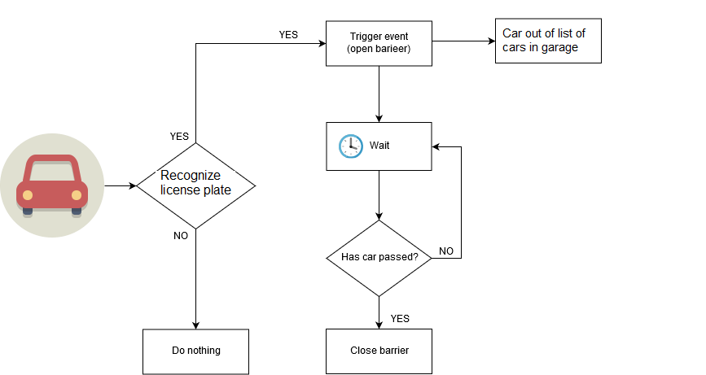
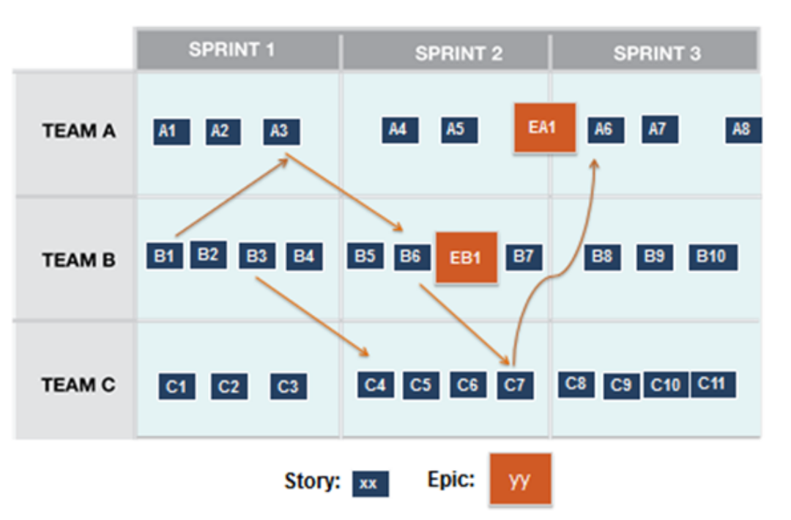
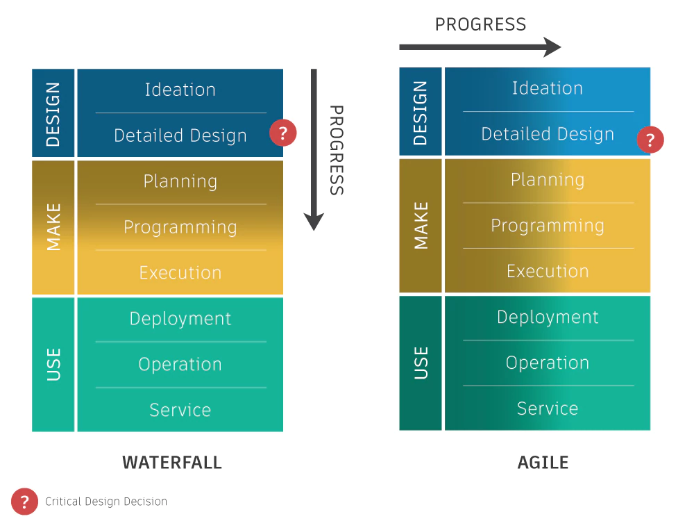

# Analyse

In de analyse vinden we de volgende elementen terug:
- Probleemstelling
- Een mindmap
- Een beschrijving
- Hardware analyse
- Software  analyse 
- Werkbeschrijving
- Planning

## Probleemstelling 

Het doel van Smart Systems is het voorzien van een oplossing voor een probleem.
Als we het probleem gedefinieerd is en neergeschreven is het eenvoudiger om een
oplossing te voorzien. De oplossing voor het probleem kan worden opgedeeld in
verschillende kleine deelproblemen. Door het probleem te zien als een som van
kleine deelproblemen lijkt het minder imposant. Als je systematisch kleine
problemen oplost dan kan je vooruitgang zien en de finish.

**Voor deze sectie van de analyse beschrijf je het hoofdprobleem in maximaal 2
tot 5 zinnen. Daarna deel je het probleem op in minimum 10 delen (Als bulletpoints).**

## Mindmap

Nu dat we het probleem hebben vastgesteld gaan we beginnen aan het formuleren
van een oplossing. De eerste stap hierin is het bundelen van losse ideeën om
het probleem aan te pakken en eventueel nog meer details over het probleem neer
te pennen. Hiervoor gebruiken we een mindmap. Met een mindmap gaan we onze
losse ideeën en gedachten op een visuele manier organiseren en met elkaar te
verbinden. Als we dit hebben gedaan is het startschot van de analyse gegeven 

**Je voegt de mindmap toe aan de analyse.Je mag dit op papier doen maar je moet
deze wel netjes inscannen, digitaal heeft de voorkeur. (Je kan Google Drawings
gebruiken)**

## Specieke analyse
In de mindmap hebben we alle mogelijke oplossingen gevisualiseerd en
verbindingen gelegd. In deze stap van de analyse gaan we één van deze
oplossingen selecteren en onderbouwen. Dit moet zowel voor hardware als
software gebeuren.

### Hardware analyse
We leggen eerst de focus op de hardware omdat deze mee de mogelijkheden van de
software oplossingen bepaalt. Voor de hardware analyse ga je de connecties van
de subsystemen weergeven en aantonen hoe dat de interface tussen beide
componenten is opgebouwd. Een voorbeeld: 

Een voorbeeld van een volledig systeem

**Stel dit op voor de voorgestelde oplossing en voeg dit toe aan de analyse**

Natuurlijk hoort er bij elke blok ook specificaties en/of elektrische
karakteristieken. Deze worden in het volgende formaat meegeven in de analyse.

| Blok           | Specificatie    | Min  | Nominaal | Max    |
| --             | --              | --   | --       | --     |
| Motor Power    | Werkspanning    | 7V   | 7.2V     | 7.V    |
| (Loodbatterij) | Stroom          |      | 500mA    | 2A     |
|                | Capaciteit      |      | 2700mAh  | &nbsp; |
| ATmega328p     | Fcpu |      | 16 MHz   |        |
|                | Werkspanning    | 4.8V | 5V       | 5.2V   |
 
**Stel dit op voor gebruikte blokken in de  oplossing en voeg dit toe aan de analyse**

Voor elk blok moet je ook een argumentatie geven waarom deze gebruikt wordt in
de voorgestelde oplossing in de analyse. Geef ook mogelijke alternatieven. Geef
deze informatie in het volgend formaat: 

| Blok            | Argumentatie                                                                                                                                                                                                                                   | Alternatieven           |
| --              | --                                                                                                                                                                                                                                             | --                      |
| Motor Power     | De loodbatterij is oplaadbaar en levert de correcte spanning voor de motorsturing. De LiPo batterij is een betere oplossing vooral door gewicht en beter behoud van capaciteit. De loodbatterij was beschikbaar en moest niet aangkocht worden | LiPo, Powerbank         |
| Wireless Driver | We maken gebruik van een nRF24L01 omdat de simpelste manier van communicatie is, geen protocol en een simpele communicatie voorziet.                                                                                                           | Bluetooth, ZigBee, WiFi |

**Stel dit op voor gebruikte blokken in de  oplossing en voeg dit toe aan de analyse**

### Software analyse

Om onze software te analyseren is een top down methodologie aangeraden. Eerst
moeten we zien wat onze datastromen zijn. Welke data word er genereerd in het
systeem, wat voor data kunnen we injecteren voor het systeem. Deze vraag is
cruciaal om parallel in team te kunnen werken. Dit moet in het begin bepaald
worden zodat je als individu aan aparte blok kunt werken van het systeem. 

Als je bepaalt hebt wat voor data er in en uit een specifieke blok van het
systeem komt, moet je ook nog bepalen in welk formaat dit gebeurt. Om dit
succesvol te doen moet er ook rekening gehouden worden met de hardware
restricties. JSON versturen over I²C met een Arduino is gedoemd om  te falen.

Voor de starten geef je aan welke data er in en/of uit een specifieke blok komt
van de hardware analyse. We geven dit weer in het volgend formaat: 

| Blok         | Data In                               | Data Uit                              |
| --           | --                                    | --                                    |
| Motor Driver | 2x PWM Signaal                        | N.V.T.                                |
| ATMega328P   | Configuratie instellingen, Sensordata | Configuratie instellingen, Sensordata |

Bij de ATMega328p zien we dat de data uit gelijk is aan de data in. Hieruit
kunnen we afleiden dan we data van ons systeem remote kunnen opvragen via de
Wireless Driver. Deze functionaliteit moet in elk project zitten.

**Maak de oplijsting voor de in en uit data van de voorgestelde oplossing in
bovenstaand formaat en voeg deze toe aan de analyse**

De machine die als mogelijke oplossing word aangebodendat we aanbieden kan in
zich in verschillende states vinden en kan transitioneren tussen verschillende
states. Om de embedded code in het project eenvoudig te kunnen debugen moeten
we weten in welke state de code zicht bevindt. Om deze states te defineren
maken we gebruik van een state diagram. Een voorbeeld hiervan kan je hieronder
terugvinden. 

**Voeg aan de analyse een state diagram toe van de voorgestelde oplossing**
*Een goed voorbeeld van een complexer state diagram kan je hier terugvinden:
[State Diagram nRF24L01](http://m8ta.com/images/470_1.png)*

Om te wisselen tussen de verschillende states moeten we de flow hiervan beschrijven in een flowchart 

**Voeg in de analyse voor elke state transition een flowchart. Verduidelijk de
nodige processen met flowchart waar nodig.**

*Op deze manier bouwen we onze software modulair. Dit is een vereiste doorheen
het project. Je werkt met meerde tijdens het project aan aparte blokken om dit
mogelijk te maken moeten de interface tusssen de aparte blokken gekend zijn.*

Als er een grafische interface nodig, dienen hiervoor mock ups gemaakt worden.

**Als er mock ups nodig zijn voeg deze toe aan de analyse**

## Projectmethode 

### Van analyse naar werkbeschrijving 

Tijdens het project word er Scrum toegepast om het voor een Agile werking. De
fijne details van dit framework is door dhr Peeters uitgelegd en worden hier
niet herhaald. Omdat dit een hardware project is liggen de accenten een beetje
anders. Scrum vind de oorsprong in Software projecten maar kan zeker in
Hardware worden toegepast. Het doel van deze sectie is het vertalen van de
analyse naar haalbare project scope en het definiëren van werk punten.

Het grootste verschil zijn de User Stories. De requirements van een software
project zijn afgeleid van functionele vereiste. Deze vereisten kijken uit een
standpunt van de gebruiker en zijn de te schrijven als een User Story. Dit komt
omdat de gebruiker een rol heeft in het project verhaal. 

Maar vanuit een hardware standpunt zijn de niet functionele vereiste even
belangrijk. Het is onmogelijke om een microcontroller applicatie te draaien als
microcontroller niet van stroom is voorzien. (Stroom is altijd nodig om een
applicatie te draaien. De infrastructuur die nodig is om een applicatie te
draaien hoeft niet in de scope van een software project te zitten. Voor een
software project kan men altijd gebruiken maken van IaaS of PaaS provider.)

Hiervoor gaan we gebruik maken van een Technical Story. Hier beschrijft men de
functionalteit zonder user perspectief. Een voorbeeld:

Je mag zowel de klassieke user stories gebruiken als de technical stories. Elke
story heeft wel de volgende vereisten:
- Title
- Narrative
- Acceptance Criteria 
- Story Points (Estimate)

**Hoe beginnen we dan de scope van het project te bepalen?**

We gaan er van uit dat ontleding van de scope component gebaseerd is i.p.v.
functionaliteit gebaseerd.

Dit doen we omdat de componenten (blokken) in het systeem al bepaald zijn in de
software -en hardware analyse.

Dus voor elke blok in het systeem maken we een epic aan. Als er blokken zijn
die voor hardware -en software samen neembaar zijn mag dit. Bij twijfel scheid
je ze. Voorzie voor elke epic 5 a 7 stories. Deze moeten gedetailleerd zijn. 

**Beschrijf je epics en stories op Jira**

### Van werkbeschrijving naar planning. 

Het grote probleem van Scrum voor Hardware projecten is dat het initieel geen
rekening houd met lange lead times. Dit is de tijd de start van een proces tot
het eind. Als we als voorbeeld nemen we het ontwikkelen van een printplaat, dit
heeft de volgende stappen met een geschatte tijd. 

| Stap                    | Geschatte tijd |
| --                      | --             |
| Schema                  | 5 dagen        |
| Design                  | 5 dagen        |
| Bestellen componenten   | 7 dagen        |
| Productie PCB           | 21 dagen       |
| Bestukken               | 1 dag          |
| Validatie               | 1 dag          |
| **Totaal aantal dagen** | **40 dagen**   |

De productie van een PCB duurt 40 dagen terwijl een sprint een duur heeft van 2
tot 4 weken (14 tot 28 dagen.) Dit zorgt voor problemen. Dit kan een blokkende
factor zijn voor specifieke zaken. Daarom moeten we enkele sprints op voorhand
inplannen. Zodat de prioriteiten goed gelegd worden en er geen dode momenten
zijn. Dit wil niet zeggen dat de volgende sprints in steen staan geschreven. Er
kan na elke sprint nog steeds geschoven worden, rekening houden met het grote
plaatje. De output van deze planning geeft als resultaat een release planning. 

Een voorbeeld: 

*De pijlen geven prerequsites weer*

**Voor je analyse document voeg je deze planning toe**
**Plan je eerste sprint op Jira**

Hou je met je planning rekening met het volgende:

T.o.v. het klassieke waterfall model gebeuren alle aspecten van het proces simultaan. Start met testen en integreren van de verschillende blokken zo snel mogelijk.

## Samengevat

**Wat moet er allemaal in je analyse document**
- Probleemstelling in 2 tot 5 lijnen
- Mindmap
- Hardware analyse
  - Hardware blokdiaram
  - Specificatie tabel
  - Argumentatie en alternatieven tabel
- Software analyse
  - Data In -en Outputs
  - State diagram
  - Flowchart
  - Mockup (Indien GUI) 
- Release plan

**Wat moet er allemaal op Jira**
- Epics
- Stories
- Eerste sprint is gepland. 

