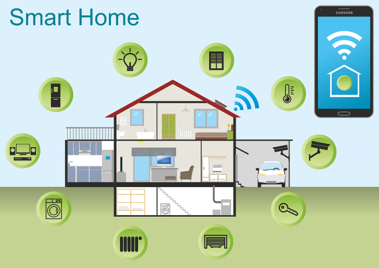

# Lab Farm 

## Korte beschrijving van het project

 We willen een woning van op afstand beheren. Hierbij denken we aan volgende elementen
- Toegang
- Verwarming regelen
- Rookdetectie
- CO-monitoring
- Inbraakbeveiliging
- ...

## Teamleden 

Dit project wordt uitgevoerd door het Home managementteam.

## Verwachte output

* Microcontroller gestuurd systeem
* Stuurbare deurvergrendeling
* Monitor voor parameters zoals rook, CO, vochtigheid,...
* Monitor voor inbraakbeveiliging
* Ontwikkeling van eventueel andere features

Het is belangrijk dat het systeem modulair opgebouwd is en gemakkelijk kan aangepast worden naar bijkomende features

