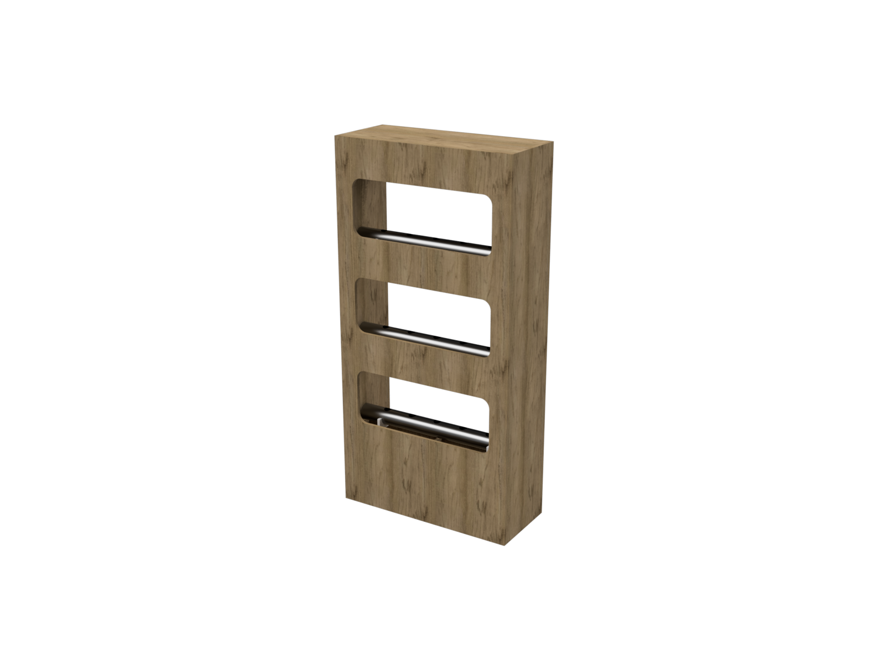

# Lab Farm 

## Korte beschrijving van het project

Afgelopen jaren zijn we al bezig met het ontwikkelen van een hydrophonics opstelling. De huidige opstelling zal nu door de Waterbaan, een middelbare school in gebruik genomen worden. 

Een deel van dit project zal draaien rond het installeren van deze opstelling op locatie. De Waterbaan zal er dan experimenten verder mee uitvoeren. Voor dat er wordt overgaan zal er een installatie handleiding/checklist opgesteld worden. Daarna voeren we hier een dry run van uit op het school. 

Eens dat de hydrophonics opstelling up en running is, zal er gekeken worden naar mogelijke uitbreiding. De vorige groep was gestart met het maken van een XY systeem waarop een camerasysteem wordt gemonteerd. De beelden worden gebruikt voor het beoordelen van de plantengroei. 

De feeback van de gebruikers ook verwerkt worden in de nieuwe features/ 

## Teamleden 

Dit project wordt uitgevoerd door het Environmental Monitoring team.

## Verwachte output

* Plaatsen van Labfarm kast @ De Waterbaan
* Langdurige test van prototype
* Ontwikkeling van nieuwe features

