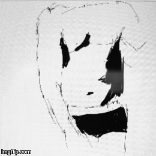
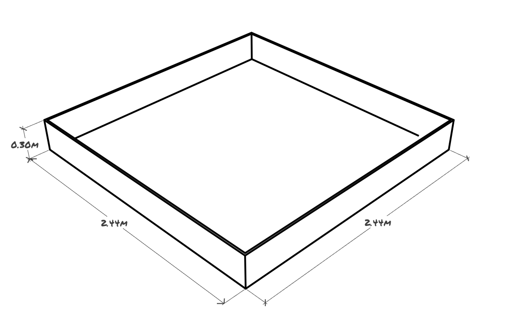

# Growing Gifs Bot
Dit jaar werken we weer samen de academie voor een project. Op de academie
loopt momenteel het onderzoeksproject *Growing Gifs*. De technische output van
het project is een applicatie die elke pennenstreek op een tekentablet
registreert en hiervan een gif maakt. De gif visualiseert de opbouw van de
tekening. Hieronder kan je een voorbeeld zien van een mogelijke output van de
software.

Wij gaan een bijdrage bijleveren aan het onderzoeksproject door de
opbouw van de tekening op een andere manier te visualiseren.
**Dit doen we door elke pennenstreek te visualiseren met een robot**

## Line Dancer

Een eerste vereiste van het project is het aanpassen van de bestaande
applicatie. De applicatie noemt Line Dancer. Dit is een opensource project, dus
we hebben toegang tot de broncode. Er zijn echter 2 moeilijkheden die we eerst
moeten overkomen. De eerste is dat de code is geschreven in C/C++. De tweede
moeilijkheid is dat de applicatie voor de moment Mac only is.  Aan het
functionele van de applicatie is er zeker één feature dat we moeten
aanpassen/aanmaken. De applicatie maakt rechstreeks een gif aan. Deze gif is
moeilijk om te vervormen naar een coördinaten stelsel en het extraheren van de
druk op de pen zal nog moeilijker zijn. Daarom is het sneller om de applicatie
aan te passen. We vormen de applicatie als volgt om:

Je kan de code hier vinden: [Line Dancer GitHub
Repository](https://github.com/lab101/LineDancer)

**Het belangrijkste aan deze vereiste is de opbouw van het teksdocument. Dit is
de interface tussen de het tekentablet en de robot. Deze interface moet vanaf
dag 1 bekend zijn.**

## GG Bot

*gg easy* zal het niet zijn. Het maken van de feitelijke robot zal het
moeilijkste zijn aan heel het project. Dit is niks voor niks de focus voor het
vak Smart Systems. De meeste resources zullen gewijd zijn aan het creëren van
de robot.

Op het einde van het project is de robot instaat de complexe vormen na tekenen.
Het ultieme doel is live de complexe vormen kunnen nateken.

Om deze robot te bouwen krijg je als groep een basiskit die  bestaat uit:
- Robotchassis
- Powerbank
- Motordriver
- Draadloze module
- Servo motor
- 9 DOF Stick
- ...

Deze componenten gecombineerd met de microcontroller kits die je groep reeds
bevatten kan je een basis prototype bouwen van de robot. De werking van de
robot kan in een notendop kan als volgt worden voorgesteld:

Hoe zit deze robot in elkaar? De robot bestaat uit verschillende
controllers die volledig standalone zijn en onderling kunnen samenwerken. De
minimale controllers kan je terugvinden op de onderstaande diagram.

### Main controller

De main controller is de centrale computer voor het aansturen van het geheel.
De inhoud en de werking is vrij in te vullen per projectgroep. Je kan kiezen
waar je welke logica steekt maar vergeet niet dat de modules stand alone moeten
zijn.

### Wireless controller

De wireless controller stuurt de gebruikte wireless module van de kit aan. De
wireless controller is in staat de juiste informatie te verzenden en te
ontvangen. Deze controller stelt ook de data beschikbaar afkomstig van de
wagen, zoals een afgelegde afstand, hoek, uit lezingen van een sensor. Dit kan
handig zijn voor het debuggen van de applicatie.

### Motor controller
 
In de Smart System kit is er een motordriver ic ter beschikking. Deze moet
inputs van het systeem omzetten naar een beweging. De robot kan zich in eender
welke positie manoeuvreren.  

### Sensor controller

Sensor controller is een generieke term. Er zijn verschillende sensoren die van
toepassing zijn voor deze opdracht. Alle ontworpen sensor controllers voor het
project zeker volgende 2 zaken: 
1. Filter de data afkomstig van het systeem. 
2. Stelt de gefilterde data afkomstig van het sensor ter beschikking van het
   systeem. Het systeem verwekt dan deze feedback/informatie.

### Stift controller

De stift controller stuurt een servo motor aan die de stift waarmee er getekend
word op en neer gaat. Het mechanisme dat de stift aanstuur moet ge 3d print worden.

## De werkomgeving

De robot maakt de tekening na in een bak met de volgende afmetingen:

In deze bak bepaal je de positie van de wagen. Daarna zal je met de behulp van
verschillende sensoren de plaats moeten bepalen in de wagen.

## Analyse
Met deze informatie kan je een beginnnen aan het project. Vooraleer dat je aan
je prototype(s) begint moet je een grondige analyse maken.  Wat er juist in
deze analyse moet staan kan je terugvinden onder *Deliverables / Analyse* in de
cursus van Smart Systems.

## Het finale resultaat

Het einddoel van dit vak is een werkende robot waarvoor een printplaat is
ontwikkeld. De constructie van deze robot gaat dus verder dan wat kabeltjes op
een breadboard. De robot is in staat de input van de Line Dancer applicatie te
verwerken en deze te gebruiken. De output van de robot is een replica van de
tekening die nagemaakt is met een hoge precisie.

