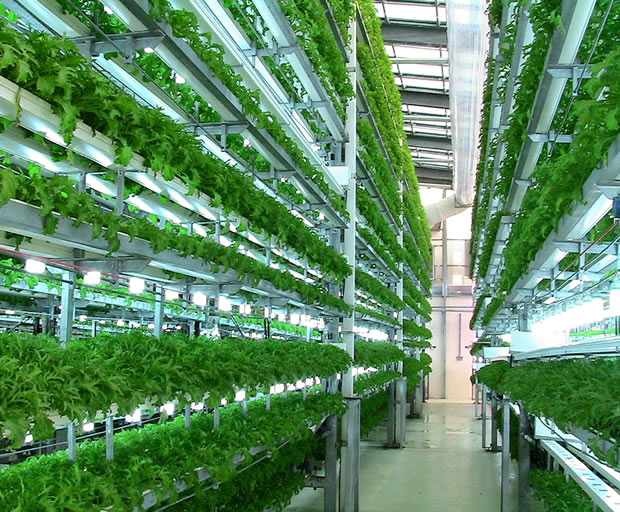

# Lab Farm 

# 1. Beschrijving

Op het school willen we een grote hydrocultuur opstelling plaatsen Hydrocultuur
of hydroponie is het kweken van planten in water, waaraan de noodzakelijke
voedingsstoffen zijn toegevoegd. Het is een kweekwijze die steeds vaker wordt
toegepast. Niet alleen voor kamerplanten, maar ook voor groenteteelt in de kas
zoals van sla, tomaat en witloof.
([https://nl.wikipedia.org/wiki/Hydrocultuur](https://nl.wikipedia.org/wiki/Hydrocultuur))
In een notendop willen we een high tech plantenbak maken.

 

Dit project is een jaarproject. Dit wil zeggen als je voor dit project kiest
dat je hier zowel tijdens Smart Systems in het 2de jaar als in IoT in het derde
jaar aan gaat werken. Waarom? We willen de scope van dit project uitbreiden van
een Proof of Concept naar een productie klare versie.  \

 

Een doel van dit project is tegen december 2019 een verticale oplossing te
hebben met een oppervlakte van 2m hoog en 4m breed (Ergens op de campus).
Natuurlijk draait het hier niet alleen om de planten maar ook om de
technologie. De productie klare versie moet voorzien zijn van sensoren en
actuatoren die allemaal via een webplatform gestuurd kunnen worden. Wat voor
sensoren en actuatoren die nodig zijn voor de opstelling maakt deel uit van het
project. 

# 2. Team

Voor de start van het project (tijdens Smart Systems) 4 personen:

Verantwoordelijkheden:

*   Projectmanager (Wordt opgenomen door 1 van de 4 teamleden)
*   Technical Lead Mechanical
*   Technical Lead Sensor
*   Technical  Lead Actuators
*   Technical Lead Webplatform

# 3. Werking

Er mag maar één groepje starten aan dit project. Dit wilt zeggen dat je
geselecteerd moet worden. De juryleden van het selectiecommissie, de geachte
heer Luyts.

## 3.1. De selectie 

### 3.1.1. Analyse

Zoals voor elk project in de elektronica vakken moet je één analyse maken.
Omdat deze analyse je op weg helpt voor een jaar, is deze nog van een groter
belang. De selectie van je insturing hangt voornamelijk af van dit.

De vereisten van deze analyses kan je in een ander document terugvinden

### 3.1.2. Kleine demoprojecten  

Voor sommige projecten is het al mogelijk om voor de technieken die nodig zijn
om dit project tot een geslaagd eind te brengen, een kleinde demo te geven. Een
heel simpel voorbeeld. Je moet voor een project object detectie gaan doen in
live video. Als je tijdens je demo kan aantonen dat je dit al voor afbeelding
kunt, helpt dit alleen maar met je selectie kansen

### 3.1.3. Presentatie

Het project wordt verdedigd door een presentatie over de analyse. Deze
presentatie duurt een 20 minuten (15min presentatie + 5min vragen)

## 3.2. Algemene werking

Voor het project volgen we een gelijkaardige werking zoals bij Smart Systems
maar vanwege de experimentele werking van de jaarprojecten zal flexibel een
keyword zijn doorheen dit jaar project. 

We gaan toch voor een agile werking met geplande meetings. Deze meetings zullen
doorgaan buiten de ingeplande lesuren. De vereiste flexibileit zorgt ook voor
enige vrijheid die afgetoetst kan worden doorheen het project. 

# 4. Doelstellingen:

*   Mechanisch ontwerp van de opstelling
    *   Proof of Concept
    *   Productieklaar
*   Sensor ontwikkeling
    *   Vochtigheid
    *   Temperatuur
    *   … 
*   Actuator ontwikkeling
    *   Belicht

# 5. Beschikbare resources:

*   Lasercutter 
*   3D Printer
*   PCB Machine
*   Beperkt budget
*   Materiaal beschikbaar in de 01.03

# 6. Inspiratiebronnen

- [https://urbancropsolutions.com/](https://urbancropsolutions.com/) 
- [https://github.com/AP-Elektronica-ICT/iot18-lf1](https://github.com/AP-Elektronica-ICT/iot18-lf1) 
- [https://github.com/AP-Elektronica-ICT/iot18-lf2](https://github.com/AP-Elektronica-ICT/iot18-lf2) 

