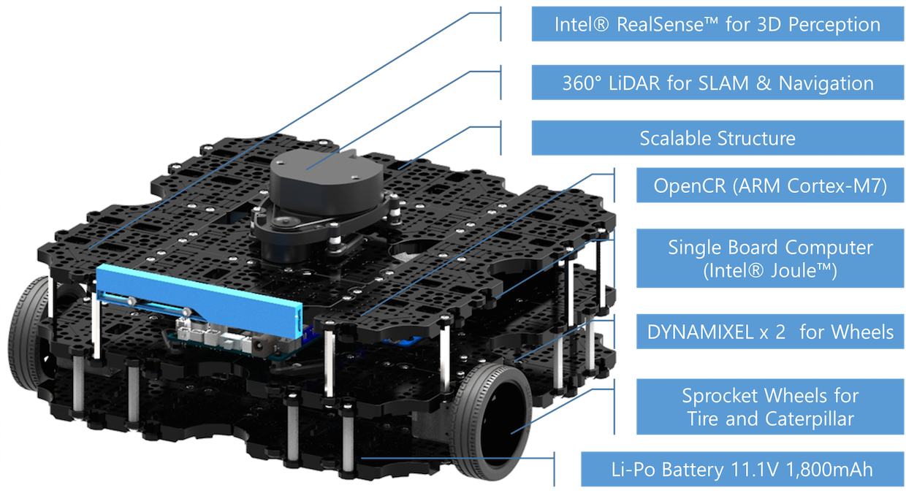

# Mixed Reality Robotics

## Korte beschrijving 

Tijdens dit project gaan we verderbouwen op het HoRo project van afgelopen semester. Dit project was een proof of concept waarbij we een robot arm controleerde m.b.v. een Hololens. 

Meer info: 

<iframe width="560" height="315" src="https://www.youtube.com/embed/umxXAjCxvtM" frameborder="0" allow="accelerometer; autoplay; encrypted-media; gyroscope; picture-in-picture" allowfullscreen></iframe>

De robot arm die we hiervoor gebruikte was niet geweldig. We hebben de volgende upgrade gekocht:

<iframe width="560" height="315" src="https://www.youtube.com/embed/bnhiZaNqpz8" frameborder="0" allow="accelerometer; autoplay; encrypted-media; gyroscope; picture-in-picture" allowfullscreen></iframe>

Deze gaan we combineren met: 

Concreet we gaan een eerst de software van de vorige opstelling porten naar de nieuwe hardware en uitbreiden.

## Teamleden 

Dit project wordt uitgevoerd door het Smart Robotics team

## Verwachte output

* Port vorig project naar nieuwe hardware
* Toevoegen van:
  * 1 extra robotarm
  * Transportband
  * Turtlebot
* Kijken naar integratie met AGV

